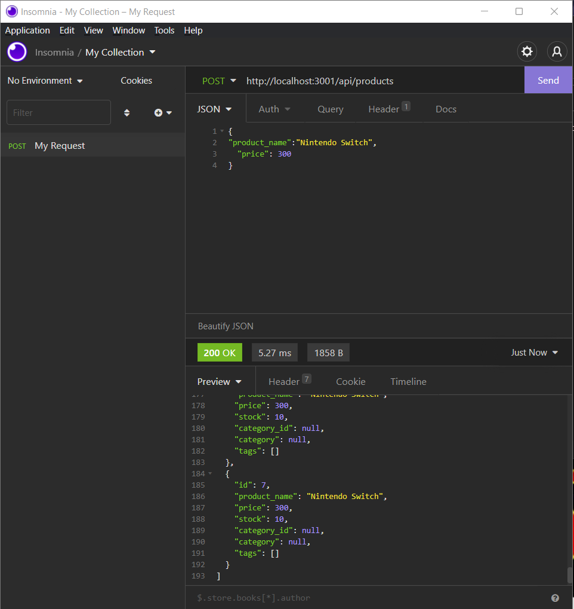

# Note Taking Application
  
## Description 
This app show products data from an SQL database and you can also see and add by category and by tags. You can create, update, and delete new items and search for an item by id.
  ## Table of Contents
  * [Usage]
  * [License]
  * [Contributing]
  * [Tests]
  * [Questions]
  
 
  ## Usage 
  You must install all dependencies and then type "npm run seed" to seed all of the existing items to the database. After that you type "npm start" to start the server. The you can go to insomnia and post, put and delete different items.

  Here is a video demonstrating how the app is supposed to work. It was cut short due to short recording time. It shows the main points of the app. Screenshots will show the rest:

  https://watch.screencastify.com/v/jsHAr7ApSsPpBOlmKw3I

  ## Screenshots
  

  ## Questions
  If you have any questions about this application please feel free to email me at brantheman8@comcast.net. If you would like to see more of my projects please visit https://github.com/brandonsauer8.
